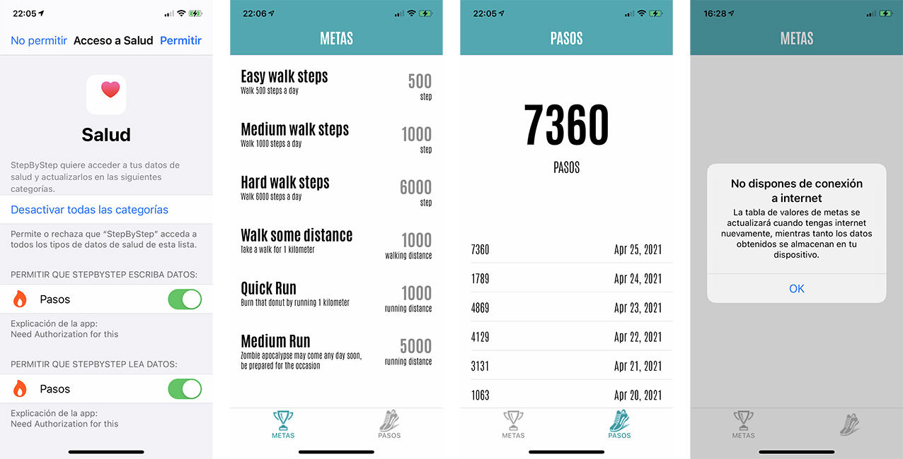

# StepByStep
Its a practice of iOS app with HealthKit Apple framework for obtain the number of step daily from our mobile device. Too can obtain a list from of the endpoint of  metrics of effort

# Build
- Xcode 12.4 
- iOS  14.1
- Device: iPhone

# Languaje Localization
- Spanish
- English
- German

# Frameworks 
- CoreData
- HealthKit
- UIKit

# Cocoapods
ReachabilitySwift

# Architecture Pattern
MVC - Model View Controller

# Unit Test
Yes

# Development and decision process
Prepare a simple mockup and icons to understand the needs of the practice and the flow of information in the application. A minimalist and clear design was used to show the data in a simple way.

Create a model with struct and codable data model include in Swift language , allows you to take advantage of the compiler to generate much of the code necessary to encode and decode data from a serialized format, such as JSON.

I chose MVC because it seemed to me according to the proposed exercise and it allows to see clearly the adaptation of the code

Use CoreData for data persistence in an outer class to reuse if necessary keeping SOLID principles.

Use Postman to verify the data call to the endPoint and check types.

For the whole process, the commits were made using the "Sourcetree" for the git repository.

I decided to use the tabBar because the data shown does not strictly depend on each other, that is, they are different information and offers better sensations to the user, alert messages were also included when it detects that you do not have an internet connection as well as indicators of process activity for a better usability experience.
In the development of functions and code, it is about working under the premise of organization, cleanCode and S.O.L.I.D. principles, and generate a clear and divided structure for better updating and understanding, as well as naming functions that are explicit enough to understand.

